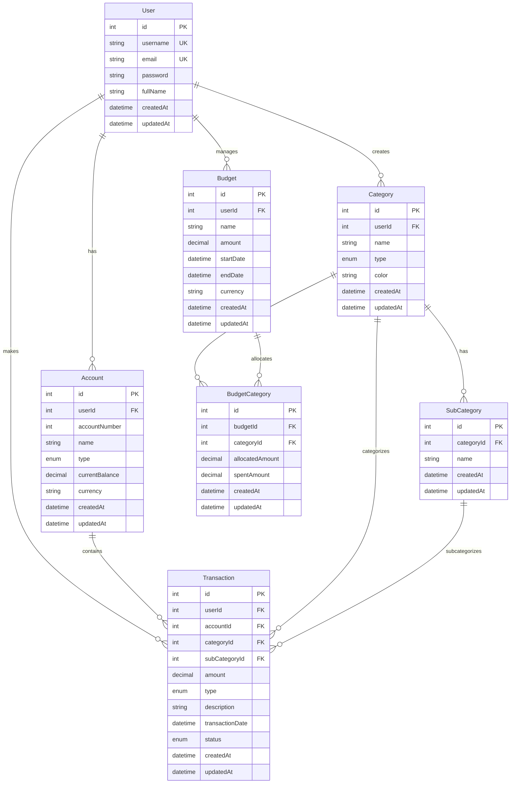

## A wallet management system for tracking transactions, generating reports, setting budgets, and visualizing financial data for multiple accounts.

## Database Schema

The application uses a PostgreSQL database with the following structure:

### Key Features of the Database Design:

1. **User-Centric Design**
   - Each user can have multiple accounts, categories, and budgets
   - All transactions are linked to a specific user for data isolation

2. **Financial Management**
   - Track multiple account types (Bank, Mobile Money, Cash, etc.)
   - Hierarchical categorization with categories and subcategories
   - Comprehensive transaction tracking with status management

3. **Budgeting System**
   - Flexible budget creation with date ranges
   - Category-based budget allocation
   - Track spent amounts against allocated budgets

4. **Data Integrity**
   - Foreign key constraints ensure data consistency
   - Unique constraints prevent duplicate entries
   - Proper indexing for optimal query performance
